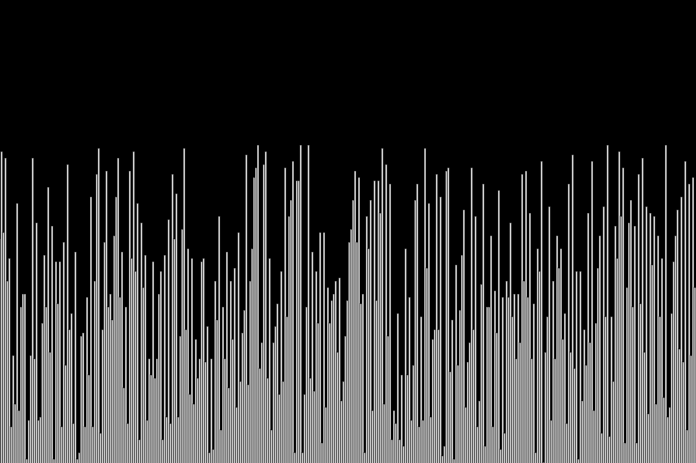
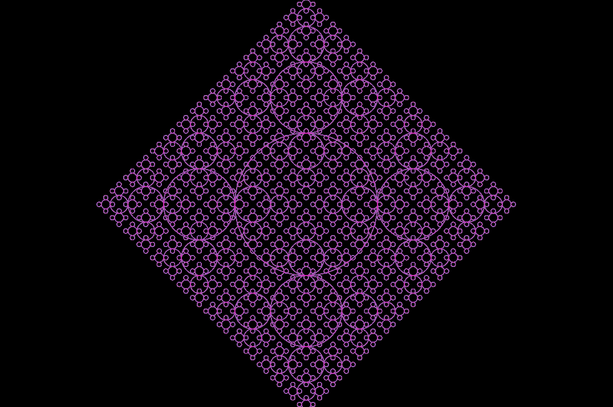
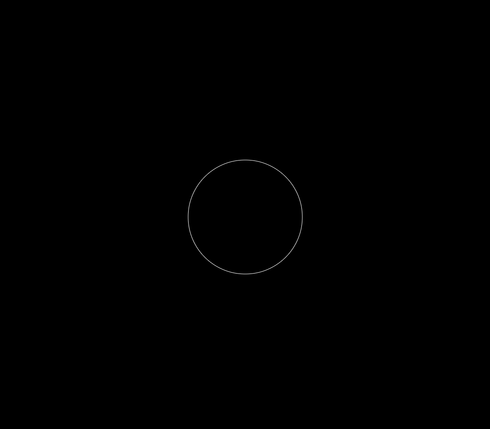
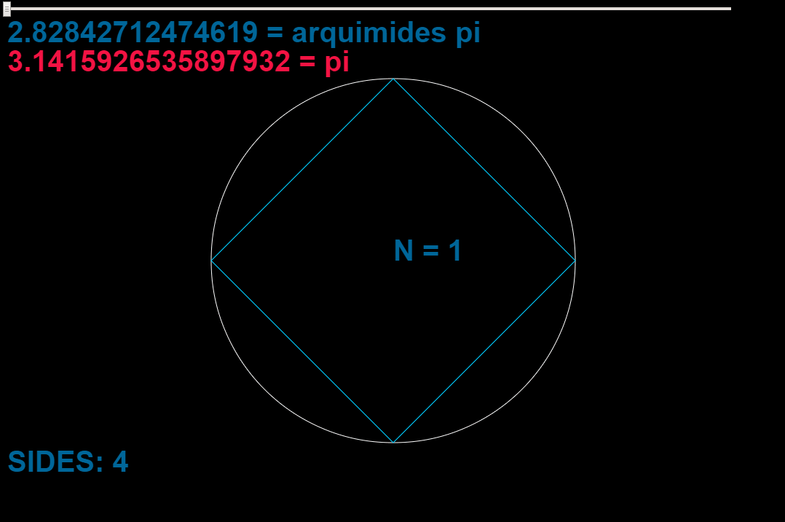

# Creative code!

Some code that i made to turn off stress

I use [P5.JS](https://p5js.org/)

## Algorithms

## Fractals

## PI

I calculate pi value because one day i just woke up and i wonder to my self, why pi is equal to 3.14...?

